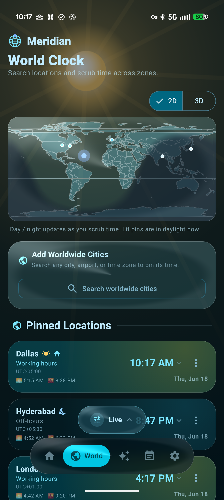
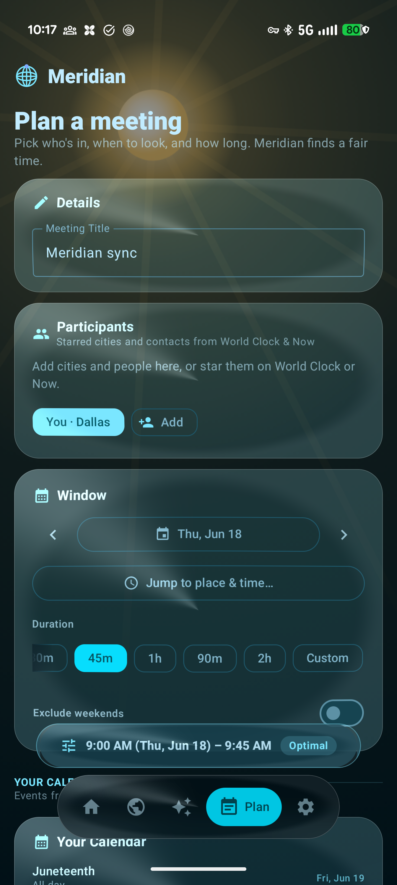
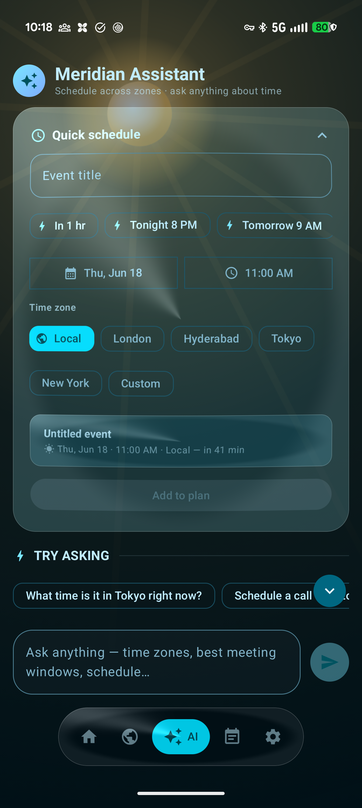

<div align="center">


# Meridian — Time & World Planner

[](https://meridian.vbcr.dev/)

</div>

Meridian is a multi-platform application (native **Kotlin/Jetpack Compose Android** and native **Swift/SwiftUI iOS + watchOS**) for **local time, world time, multi-zone planning, and AI-assisted scheduling**. It features a bold **Material 3 Expressive** design system on Android and an **Apple-style Liquid Glass** design system across both platforms (utilizing Haze blur and custom canvas compositor / AGSL refraction pass).

See the [docs/adr](file:///Users/bharath/Code/apps/Meridian/docs/adr) directory for key architectural decisions.

<div align="center">



</div>

## Key Features

- **Now** — live local clock with locale-aware 12/24h formatting, timezone offset board, and pinned zones.
- **World** — a 2D equirectangular **day/night terminator** map (correct solar geometry), per-zone sun times, and a one-tap **home zone**, all driven by the shared time **scrubber** (`scrubInstant`).
- **World (3D)** — toggle to an asset-free **orthographic globe** (day/night shading, drag-to-spin, visible-hemisphere pins) that auto-drops to 2D under battery saver / low-RAM.
- **Plan** — a real **meeting planner**: add participant zones *and named people*, each with their own **working hours + do-not-disturb** window; pick a date and duration and get fairness-ranked slots annotated with everyone's local time and an awake/working/asleep tag. Create a zone-aware calendar event, share an RFC-5545 `.ics` invite, or generate a **rotating weekly series** that spreads the inconvenient hour between regions. Picking a slot schedules a reminder.
- **AI Assistant** — an **on-device** assistant (Gemini Nano on Android via Firebase AI Logic, Apple Foundation Models on iOS, with automatic cloud fallback) that drafts events; writes only after an explicit confirm step, with schema/zone validation. Each reply is badged with where it ran (on-device vs cloud).
- **Settings** — DataStore-persisted settings (Android) and SwiftData preferences (iOS), glass compositor toggle, reduce-transparency override, and a privacy-friendly **location → home zone** resolver, all wired into the live UI.
- **Adaptive UI** — floating glass bottom bar on phones, glass navigation rail on tablets/foldables/iPad.
- **Surfaces** — home-screen widgets (Glance on Android, WidgetKit on iOS), world-times tile/control (Quick Settings tile on Android, Control Center control on iOS), launcher shortcuts / app shortcuts, reminders (exact-alarm / NotificationService), Live Activities (iOS `EventCountdownLiveActivity` / ongoing Android notification), and standalone smartwatch integration (Wear OS tile & watchOS companion app).

---

## Semantic AI & Data Layer

Meridian features a declarative and optimized semantic AI layer to translate natural language queries into correct structured app executions:

1. **Application Semantic Model ([semantic/](file:///Users/bharath/Code/apps/Meridian/semantic))**:
   - Uses **Cube YAML** notation to model conformed timezone dimensions, contacts/people, and task schedules.
   - Defines safe semantic views (`people_directory`, `task_schedule`, `zone_registry`) in [meridian.yml](file:///Users/bharath/Code/apps/Meridian/semantic/meridian.yml) to prevent chasm traps when joining one-to-many relationships.
   - Declares domain "verbs" as semantic functions in [functions.yml](file:///Users/bharath/Code/apps/Meridian/semantic/functions.yml) (`get_current_time`, `convert_time`, `find_meeting_time`).
2. **Semantic Caching & Routing Reference ([tools/semantic_layer/](file:///Users/bharath/Code/apps/Meridian/tools/semantic_layer))**:
   - An edge-optimized reference implementation in Python utilizing `sentence-transformers` and `FAISS`.
   - **Dynamic threshold calibration (\(\tau\))**: Auto-tunes cosine similarity threshold to balance false hits against miss rate.
   - **Context Compression**: Knapsack-relevance-based token reduction to retain \(\ge 90\%\) answer recall.
   - **Complexity Router**: Routes simple tasks to smaller model tiers and complex tasks to larger tiers.
3. **Mobile Client Implementations**:
   - [SemanticLayer.kt](file:///Users/bharath/Code/apps/Meridian/app/src/main/java/com/example/core/ai/SemanticLayer.kt) and [SemanticLayer.swift](file:///Users/bharath/Code/apps/Meridian/ios/MeridianApp/Core/AI/SemanticLayer.swift) implement matching lightweight routing and cache contracts. They use local trigrams and regex/rule-based heuristics to run with zero network overhead.

For more details on the design, see [docs/semantic-layer-architecture.md](file:///Users/bharath/Code/apps/Meridian/docs/semantic-layer-architecture.md).

---

## Run Locally

### Prerequisites
- **JDK 21+** (required for unit tests on compileSdk 36) and the **Android SDK** (compileSdk 36) configured via `ANDROID_HOME` or `local.properties`.
- **Xcode 27+** and **iOS 27 / watchOS 27** SDKs.
- [**XcodeGen**](https://github.com/yonaskolb/XcodeGen) (`brew install xcodegen`) to generate the iOS project.
- **Python 3.9+** (if running the semantic layer benchmark).

### Unified Build
You can build and test both platforms at once:
```bash
make build-all
# or: ./scripts/build-all.sh
```

### Android Build
```bash
./gradlew :app:assembleDebug         # build the debug APK
./gradlew :app:installDebug          # install on a connected device/emulator
./gradlew :app:testDebugUnitTest     # run unit tests
```

### iOS & watchOS Build
Meridian uses XcodeGen to keep the repository free of bloated project files. Before building, generate the city search database:
```bash
# Generate cities.db and copy it to the iOS resources bundle
python tools/citygen/build_cities_db.py
cp cities.db ios/MeridianApp/Resources/cities.db

# Generate project and build
cd ios
xcodegen generate
xcodebuild -project Meridian.xcodeproj -scheme Meridian -destination 'platform=iOS Simulator,name=iPhone 16' build
```
You can also build from the root via:
```bash
make ios
```
For more information, see [ios/README_iOS.md](file:///Users/bharath/Code/apps/Meridian/ios/README_iOS.md).

### Semantic Layer Benchmarks
To run latency and accuracy benchmarks for the semantic AI layer reference implementation:
```bash
cd tools/semantic_layer
pip install -r requirements.txt
python -m semantic_layer.benchmark --queries 1000
# or: make semantic-bench
```

### Store assets & map texture
Regenerate Play Store artwork and the equirectangular Earth texture:
```bash
make gen-icon              # store_assets/ic_launcher_512.png
make gen-feature-graphic   # store_assets/feature_graphic.png
make gen-earth             # app/.../drawable/world_map.png
make build-cities          # GeoNames → cities.db (+ app assets copy)
```

---

## Codebase Structure

```
├── app/                       # Android app (Kotlin, Jetpack Compose, Glance widgets)
│   └── src/main/java/com/example/core/   # Shared domain, logic, and AI engines
├── ios/                       # iOS app (SwiftUI, SwiftData, WidgetKit, watchOS app)
│   ├── MeridianApp/           # Main SwiftUI application and view models
│   ├── MeridianWidget/        # Home-screen widget and Live Activity extension
│   ├── MeridianWatch/         # Companion watchOS app
│   └── Shared/                # Shared structures between app, watch, and widget
├── wear/                      # Wear OS app module
├── semantic/                  # Cube YAML schema mapping and semantic functions declaration
├── tools/
│   ├── citygen/               # Tools for generating local SQLite city search database
│   └── semantic_layer/        # Reference Python semantic cache, router, and benchmarks
└── docs/                      # Architectural Decision Records (ADRs) & specs
```
