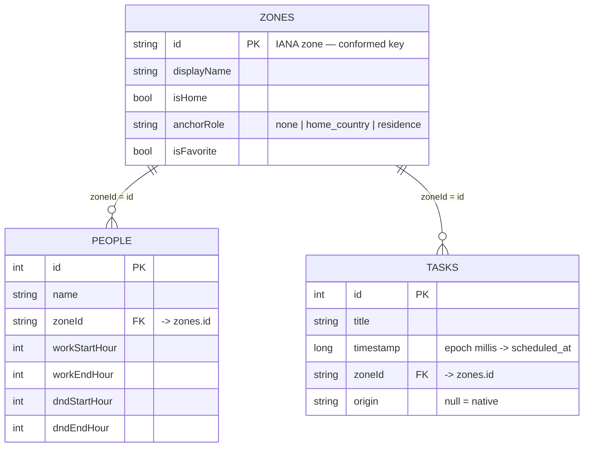

# Meridian — Application Semantic Layer

A **data-model semantic layer over Meridian's own domain** (the on-device Room /
SQLite database) — authored so an LLM / AI data-agent can translate natural
language into correct structured queries.

This is deliberately **not** a semantic layer over the repository/codebase (that
is what GitNexus provides). It models the *app's data*: saved zones, people, and
planned tasks, plus the domain's compute functions.

| File | What it holds |
|------|---------------|
| [`meridian.yml`](meridian.yml) | Cubes (`zones`, `people`, `tasks`), their dimensions & measures, joins with cardinalities, and fan-out-safe **views**. |
| [`functions.yml`](functions.yml) | The domain "verbs" — `get_current_time`, `convert_time`, `find_meeting_time` — as parameterized semantic functions + the caching/routing contract. |

Format is **Cube YAML** (a portable, AI-oriented modelling notation). The same
model maps cleanly to dbt semantic models or LookML. It is a *specification*
artifact: it documents the contract and can also be loaded by Cube or consumed
directly as grounding metadata by the app's agent.

## Schema mapping (model ⇄ real columns)

Every `sql` reference tracks an actual Room column, so the layer stays truthful.

| Cube | SQLite table | Source of truth | Primary key |
|------|--------------|-----------------|-------------|
| `zones` | `saved_zones` | `core/data/SavedZone.kt` | `id` (IANA zone) |
| `people` | `people` | `core/data/Person.kt` | `id` (autogen) |
| `tasks` | `planned_tasks` | `core/data/PlannedTask.kt` | `id` (autogen) |

## Entity graph

**`zone` is the conformed dimension.** The IANA id is shared by `zones.id`,
`people.zoneId`, and `tasks.zoneId`. All cross-entity questions route *through*
zone. Because `zones→people` and `zones→tasks` are **both one-to-many**, joining
people and tasks onto zones simultaneously is a **chasm trap** (row fan-out →
inflated counts). The `views` enforce the safe paths: `people_directory` and
`task_schedule` each expose exactly one many-to-one join; `zone_registry` stays
zone-only. Agents should query **views**, not raw cubes.

**Orphan-zone caveat (graph completeness):** a person or task may reference a
zone the user hasn't pinned, so those joins are LEFT joins and can yield a null
zone — expected, not a broken reference.

## Time hierarchy

`tasks.scheduled_at` is derived from the epoch-millis `timestamp`
(`datetime(timestamp/1000,'unixepoch')`) and supports the standard roll-up
`hour → day → week → month → quarter → year`, plus relative measures
`upcoming_count` / `past_count` (bounded at the current instant).

## How the app's AI agent consumes this

The runtime layer in `core/ai/` already embodies this contract:

- **`MeridianAiTools`** builds the grounding block (LIVE CLOCK / TIME CONVERSIONS
  / MEETING SLOTS) from these same entities and exposes the three functions as
  Gemini `FunctionDeclaration`s — the `functions.yml` verbs.
- **`SemanticRouter` / `SemanticCachePolicy`** implement `functions.yml`'s
  `routing` block: time-valued answers are never cached stale, and `SCHEDULE`
  (an action) is never replayed.

So `functions.yml` is the *declarative* view of behavior that lives imperatively
in `SemanticLayer.kt` + `MeridianAiTools.kt`.

## How it answers the original audit dimensions

1. **Architectural integrity & wiring** — joins carry explicit `relationship`
   cardinalities; the conformed `zone` key connects an otherwise-disconnected
   `people`/`tasks` pair; the chasm trap is called out and prevented via views.
2. **AI / LLM readiness** — every dimension/measure has a `title`, a
   `description`, and `meta.synonyms` (+ `sample_values` / `allowed_values`) so
   an agent maps "contacts", "clocks", "what's next" onto the right entity.
3. **Gap analysis** — added the missing time hierarchy on `scheduled_at`, the
   `upcoming`/`past` relative metrics, per-anchor-role zone counts, and the
   compute verbs that the raw tables imply but don't store.
4. **Redundancy / conformance** — `zoneId` appears in three tables; rather than
   three overlapping "timezone" dimensions, it is modelled once as the conformed
   `zone` and referenced by join, eliminating duplicate definitions.

## Validating / extending

- Treat as a spec, or point a Cube instance at the SQLite DB and load `/semantic`.
- When a Room entity gains a column, add the matching dimension/measure here and
  update the schema-mapping table above so the layer never drifts from the DB.
